```mermaid
flowchart TD
    trigger[GitHub Action Triggered<br/>push / pull_request / workflow_dispatch] --> validate[Validate Inputs<br/>validateInputs → config]
    validate --> stateSetup[State Tracking Setup<br/>resolve workflow repo, branch,<br/>detect first run via state file<br/>or workflow history]
    stateSetup --> authenticate[Authenticate → MSAL Token]
    authenticate --> getEventCtx[Get Event Context Info<br/>getPrInfo: push / PR / dispatch<br/>author, branch, title, url,<br/>prNumber, PR description]
    getEventCtx --> setPrCtx[Set PR context on PayloadBuilder<br/>prNumber, prDescription]
    setPrCtx --> isFirstRun{First Run or<br/>Manual Dispatch?}

    %% ── Full Scan Path (first run or manual dispatch) ──
    isFirstRun -->|Yes| getAllFiles[Get repo files at base ref<br/>getAllRepoFiles · atRef = boundary SHA<br/>git ls-tree for PR base state<br/>binary files auto-skipped]
    getAllFiles --> hasFiles{Files found?}
    hasFiles -->|No| noFilesLog[Log: no files for full scan]
    hasFiles -->|Yes| tenantPS[Call searchTenantProtectionScope<br/>POST .../protectionScopes/compute]
    tenantPS --> tenantPSOk{Tenant PS success?}
    tenantPSOk -->|No| fullScanFallback[Fallback: contentActivities<br/>uploadSignal for ALL files]
    tenantPSOk -->|Yes| tenantHasScopes{Tenant PS has<br/>protection scopes?}
    tenantHasScopes -->|No / empty| fullScanFallback
    tenantHasScopes -->|Yes| groupByUserFull[Group files by userId<br/>authorId or config.userId]
    groupByUserFull --> fullUserPS

    subgraph FULL_SCAN_PER_USER [For each userId — full scan]
        fullUserPS[Call searchUserProtectionScope<br/>POST /users/userId/.../protectionScopes/compute<br/>check userPsCache first · cache on success] --> fullUserPSOk{User PS success?}
        fullUserPSOk -->|No / 401| fullIs401{401?}
        fullIs401 -->|Yes| fullCache401[Cache userId in<br/>userPsDeniedCache]
        fullIs401 -->|No| fullUserFallback[Fallback: contentActivities<br/>uploadSignal for user's files]
        fullCache401 --> fullUserFallback
        fullUserPSOk -->|Yes| fullUserHasScopes{User PS has scopes?}
        fullUserHasScopes -->|No / empty| fullUserFallback
        fullUserHasScopes -->|Yes| fullPCABatch[Build PCA batch for user<br/>processContentAsync<br/>content ≤ 3 MB per chunk<br/>request ≤ 3.7 MB per batch<br/>Part: N in accessedResources on split]
        fullPCABatch --> fullPCAOk{PCA success?}
        fullPCAOk -->|No| fullUserFallback
        fullPCAOk -->|Yes| fullPCADone[PCA complete for user]
    end

    fullScanFallback --> fullScanCommits
    fullUserFallback --> fullScanCommits
    fullPCADone --> fullScanCommits

    fullScanCommits[Process full-scan commits<br/>getAllRepoCommits up to boundary SHA<br/>per-commit user PS routing<br/>batched via buildCommitProcessContentBatchRequest<br/>content includes PR description when available] --> writeState[Write state marker<br/>best-effort]
    writeState --> isManualDispatch{Manual Dispatch?}
    isManualDispatch -->|Yes| skipDiff[Log: skipping diff processing]
    isManualDispatch -->|No| getCommits
    noFilesLog --> isManualDispatch

    %% ── Diff Path (push & pull_request — skipped on manual dispatch) ──
    isFirstRun -->|No| getCommits
    getCommits[Get commits<br/>push payload / PR commits /<br/>compare API]
    getCommits --> findLastProcessed[Find last processed commit<br/>paginate workflow run history<br/>match head_sha to commit list<br/>scoped by branch: PR head or push ref]
    findLastProcessed --> getGroupedFiles[Get files grouped by commit<br/>getFilesGroupedByCommit<br/>skip already-processed commits<br/>resolve author + committer emails → userIds<br/>via users.json + Graph API cache]
    getGroupedFiles --> hasCommitGroups{New commits<br/>to process?}
    hasCommitGroups -->|No| noChangedFilesLog[Log: no new commits to process]
    hasCommitGroups -->|Yes| commitLoop

    subgraph PER_COMMIT_USER [For each commit → for each userId]
        commitLoop[Group commit files by userId<br/>authorId or config.userId]

        commitLoop --> resolvePS[resolveUserPsWithCache<br/>check denied cache → PS cache →<br/>call searchUserProtectionScope<br/>cache 401s · cache success]
        resolvePS --> psResolved{PS resolved?}
        psResolved -->|No / denied / failed| diffUserFallback[Fallback: contentActivities<br/>uploadSignal for user's files]
        psResolved -->|Yes| checkScopes[checkApplicableScopes<br/>activity match + location match]
        checkScopes --> shouldProcess{shouldProcess?}
        shouldProcess -->|No| diffNoScopesFallback[Route all files →<br/>contentActivities<br/>uploadSignal per file]
        shouldProcess -->|Yes| execMode{executionMode?}

        execMode -->|evaluateInline| processContent[Per-file: processContent<br/>POST /users/userId/.../processContent<br/>If-None-Match: etag<br/>Prefer: evaluateInline<br/>agents: committer AiAgentInfo<br/>content ≤ 3 MB · request ≤ 3.7 MB]
        processContent --> pcOk{PC success?}
        pcOk -->|No| pcFallback[Fallback: contentActivities<br/>uploadSignal for file]
        pcOk -->|Yes| scopeState{protectionScopeState?}
        scopeState -->|modified| refetchAndRetry[Re-fetch userPS<br/>retry processContent<br/>with fresh etag]
        refetchAndRetry --> retryOk{Retry success?}
        retryOk -->|No| retryFailed[Log failure, continue<br/>add to failedPayloads]
        retryOk -->|Yes| parsePolicyActions
        scopeState -->|notModified| parsePolicyActions[Parse policyActions]
        parsePolicyActions --> isBlocked{blockAccess or<br/>restrictionAction=block?}
        isBlocked -->|Yes| addToBlocked[Add to blockedFiles]
        isBlocked -->|No| continueInline[Continue]

        execMode -->|evaluateOffline| pcaBatch[PCA batch for user<br/>processContentAsync<br/>content ≤ 3 MB per chunk<br/>request ≤ 3.7 MB per batch<br/>Part: N in accessedResources on split]
        pcaBatch --> pcaBatchOk{PCA success?}
        pcaBatchOk -->|No| pcaBatchFallback[Fallback: contentActivities<br/>uploadSignal for user's files]
        pcaBatchOk -->|Yes| continueOffline[Continue]
    end

    diffUserFallback --> nextUser[Next user / commit]
    diffNoScopesFallback --> nextUser
    pcFallback --> nextUser
    addToBlocked --> nextUser
    continueInline --> nextUser
    retryFailed --> nextUser
    pcaBatchFallback --> nextUser
    continueOffline --> nextUser

    nextUser --> commitReq[Send commit-level request<br/>commit metadata + PR description +<br/>file list in accessedResources<br/>batched via buildCommitProcessContentBatchRequest<br/>same routing: PS → inline/offline/fallback<br/>content ≤ 3 MB · request ≤ 3.7 MB]
    commitReq --> nextCommit[Next commit / done]

    nextCommit --> hasBlockedFiles{blockedFiles<br/>not empty?}
    hasBlockedFiles -->|Yes| eventType{Event type?}
    hasBlockedFiles -->|No| continueToOutputs[Continue]
    eventType -->|pull_request| postPrComment[Post PR review comment<br/>pulls.createReview<br/>blocked files: File + Action table]
    eventType -->|push| postCommitComment[Post commit comment<br/>repos.createCommitComment<br/>blocked files: File + Action table]
    eventType -->|other| skipNotification[Skip notification]
    postPrComment --> continueToOutputs
    postCommitComment --> continueToOutputs
    skipNotification --> continueToOutputs

    noChangedFilesLog --> setOutputs
    skipDiff --> setOutputs
    continueToOutputs --> setOutputs[Set action outputs<br/>processed-files, failed-requests,<br/>blocked-files JSON]
    setOutputs --> writeSummary[Write Job Summary<br/>file count + failures +<br/>blocked files: File + Action table]
    writeSummary --> hasBlockedFinal{blockedFiles<br/>count > 0?}
    hasBlockedFinal -->|Yes| actionFailed[core.setFailed<br/>Action FAILED:<br/>blocked files detected]
    hasBlockedFinal -->|No| actionSucceeded[Action succeeded]

    style validate fill:#e1bee7,color:#000
    style processContent fill:#f9a825,color:#000
    style pcaBatch fill:#66bb6a,color:#000
    style fullPCABatch fill:#66bb6a,color:#000
    style diffNoScopesFallback fill:#42a5f5,color:#fff
    style fullScanFallback fill:#42a5f5,color:#fff
    style fullUserFallback fill:#42a5f5,color:#fff
    style diffUserFallback fill:#42a5f5,color:#fff
    style pcFallback fill:#42a5f5,color:#fff
    style pcaBatchFallback fill:#42a5f5,color:#fff
    style addToBlocked fill:#ef5350,color:#fff
    style postPrComment fill:#ef5350,color:#fff
    style postCommitComment fill:#ef5350,color:#fff
    style actionFailed fill:#ef5350,color:#fff
    style fullCache401 fill:#ff9800,color:#000
    style resolvePS fill:#ce93d8,color:#000
    style findLastProcessed fill:#ce93d8,color:#000
    style getGroupedFiles fill:#ce93d8,color:#000
    style commitReq fill:#80cbc4,color:#000
    style fullScanCommits fill:#80cbc4,color:#000
    style setPrCtx fill:#e1bee7,color:#000
```

### Legend
- 🟣 **Purple** — Setup & shared helpers: validation, PR context, `resolveUserPsWithCache`, commit dedup & user resolution (Graph API / users.json)
- 🟡 **Yellow** — processContent (PC) inline: synchronous, per-user, can detect blocks; includes committer AiAgentInfo
- 🟢 **Green** — processContentAsync (PCA) batch: fire-and-forget, chunked (content ≤ 3 MB, request ≤ 3.7 MB); includes committer AiAgentInfo
- 🔵 **Blue** — contentActivities (uploadSignal): fire-and-forget, fallback on failures
- 🔴 **Red** — Block detection, blocked files notification (PR review comment or commit comment) & action failure
- 🟠 **Orange** — 401 denial cache (skip user on subsequent calls)
- 🩵 **Teal** — Commit-level request (commit metadata + PR description + changed file list, same PS routing as files)

### Payload Size Limits
| Limit | Value | Enforced by |
|-------|-------|-------------|
| Content data field | ≤ 3 MB | `maxContentSize` — content chunked into parts with `Part: N` in accessedResources name |
| Total request | ≤ 3.7 MB | `maxRequestSize` — items split across batches; accessedResources included in size check |

### accessedResources Format
- **Identifier**: `PR: <number> Commit: <sha>` (PR prefix only when available; omitted for full scans)
- **Name (files)**: `Repo: <repo> File: <filename> Path: <path>` (+ `Part: N` when chunked)
- **Name (commits)**: `Repo: <repo> Commit: <sha>` (+ `Part: N` when chunked)
- **isCrossPromptInjectionDetected**: always `false`