```mermaid
flowchart TD
    A[GitHub Action Triggered] --> B[State Tracking Setup<br/>resolve workflow repo, branch,<br/>lookup state marker]
    B --> C[Authenticate → MSAL Token]
    C --> D[Get PR Info]
    D --> E{First Run?}

    %% ── Full Scan Path (first run only) ──
    E -->|Yes| F[Get ALL repo files<br/>getAllRepoFiles]
    F --> G{Files found?}
    G -->|No| H[Log: no files for full scan]
    G -->|Yes| I[Call searchTenantProtectionScope<br/>POST .../protectionScopes/compute]
    I --> J{Tenant PS success?}
    J -->|No| J1[Fallback: contentActivities<br/>uploadSignal for ALL files]
    J -->|Yes| J2{Tenant PS has<br/>protection scopes?}
    J2 -->|No / empty| J1
    J2 -->|Yes| J3[Group files by userId<br/>authorId or config.userId]
    J3 --> J4

    subgraph FULL_SCAN_PER_USER [For each userId — full scan]
        J4[Call searchUserProtectionScope<br/>POST /users/userId/.../protectionScopes/compute] --> J5{User PS success?}
        J5 -->|No / 401| J5a{401?}
        J5a -->|Yes| J5b[Cache userId in<br/>userPsDeniedCache]
        J5a -->|No| J6[Fallback: contentActivities<br/>uploadSignal for user's files]
        J5b --> J6
        J5 -->|Yes| J7{User PS has scopes?}
        J7 -->|No / empty| J6
        J7 -->|Yes| J8[Build PCA batch for user<br/>processContentAsync]
        J8 --> J9{PCA success?}
        J9 -->|No| J6
        J9 -->|Yes| J10[Log: PCA complete for user]
    end

    J1 --> P
    J6 --> P
    J10 --> P
    H --> P
    P[Write state marker<br/>best-effort]
    P --> S

    %% ── PR Diff Path (always runs) ──
    E -->|No| S
    S[Get PR changed files<br/>getLatestPushFiles]
    S --> T{Changed files found?}
    T -->|No| U[Log: no changed files]
    T -->|Yes| V[Group files by userId<br/>authorId or config.userId]
    V --> W0

    subgraph PER_USER [For each userId]
        W0{userId in<br/>userPsDeniedCache?} -->|Yes| X1[Fallback: contentActivities<br/>uploadSignal for user's files]
        W0 -->|No| W[Call searchUserProtectionScope<br/>POST /users/userId/.../protectionScopes/compute<br/>capture etag]
        W --> X{User PS success?}
        X -->|No / 401| X0{401?}
        X0 -->|Yes| X0a[Cache userId in<br/>userPsDeniedCache]
        X0a --> X1
        X0 -->|No| X1
        X -->|Yes| X2{User PS response has scopes?}
        X2 -->|No / empty| X3[Route all files →<br/>contentActivities<br/>uploadSignal per file]
        X2 -->|Yes| Y[checkApplicableScopes<br/>activity match + location match]
        Y --> Z{shouldProcess?}
        Z -->|No| X3
        Z -->|Yes| AA{executionMode?}

        AA -->|evaluateInline| AB[Per-file: processContent<br/>POST /users/userId/.../processContent<br/>If-None-Match: etag<br/>Prefer: evaluateInline]
        AB --> AC{PC success?}
        AC -->|No| AC1[Fallback: contentActivities<br/>uploadSignal for file]
        AC -->|Yes| AD{protectionScopeState?}
        AD -->|modified| AE[Re-fetch userPS<br/>retry processContent<br/>with fresh etag]
        AD -->|notModified| AF[Parse policyActions]
        AE --> AF
        AF --> AG{blockAccess or<br/>restrictionAction=block?}
        AG -->|Yes| AH[Add to blockedFiles]
        AG -->|No| AI[Continue]

        AA -->|evaluateOffline| AJ[PCA batch for user<br/>processContentAsync]
        AJ --> AJ1{PCA success?}
        AJ1 -->|No| AJ2[Fallback: contentActivities<br/>uploadSignal for user's files]
        AJ1 -->|Yes| AJ3[Continue]
    end

    X1 --> AK[Next user / done]
    X3 --> AK
    AC1 --> AK
    AH --> AK
    AI --> AK
    AJ2 --> AK
    AJ3 --> AK

    AK --> AL{blockedFiles<br/>not empty?}
    AL -->|Yes| AM[Post PR review comment<br/>pulls.createReview<br/>blocked file details table]
    AL -->|No| AN[Continue]
    AM --> AN

    U --> AO
    AN --> AO[Set action outputs<br/>processed-files, failed-requests,<br/>blocked-files JSON]
    AO --> AP[Write Job Summary<br/>file count + failures +<br/>blocked files table]

    style AB fill:#f9a825,color:#000
    style AJ fill:#66bb6a,color:#000
    style J8 fill:#66bb6a,color:#000
    style X3 fill:#42a5f5,color:#fff
    style J1 fill:#42a5f5,color:#fff
    style J6 fill:#42a5f5,color:#fff
    style X1 fill:#42a5f5,color:#fff
    style AC1 fill:#42a5f5,color:#fff
    style AJ2 fill:#42a5f5,color:#fff
    style AH fill:#ef5350,color:#fff
    style AM fill:#ef5350,color:#fff
    style J5b fill:#ff9800,color:#000
    style X0a fill:#ff9800,color:#000
```

### Legend
- 🟡 **Yellow** — processContent (PC) inline: synchronous, per-user, can detect blocks
- 🟢 **Green** — processContentAsync (PCA) batch: fire-and-forget
- 🔵 **Blue** — contentActivities (uploadSignal): fire-and-forget, fallback on failures
- 🔴 **Red** — Block detection & PR review comment
- 🟠 **Orange** — 401 denial cache (skip user on subsequent calls)
-  **Purple** — External API calls (Graph API user lookup, GitHub API users.json fetch)